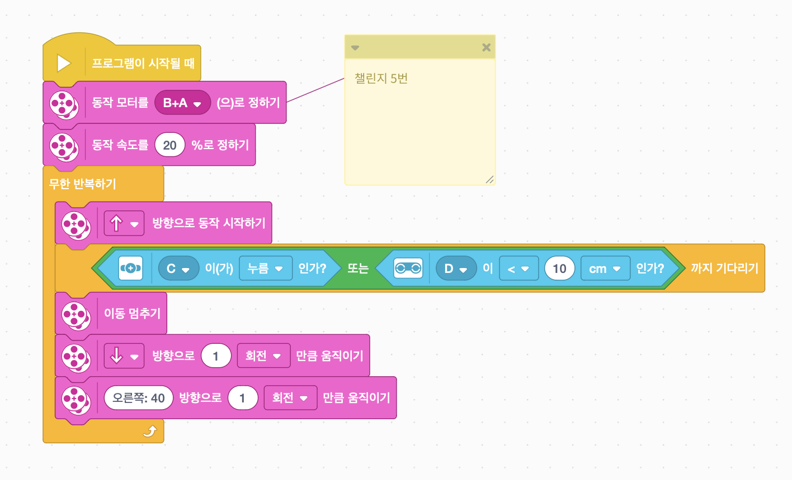

## Spike Prime 익히기

> 우연한 기회에 접하게 된 Lego Spike Prime! 기본적인 내용부터 파악해보자!

### 오리엔테이션

#### 소개

---

- 강사소개
  - 고향, 근무학교
  - 강사이력 : 강원교육과학정보원 정보영재 강사
  - 스파이크 프라임
    1.  결국은 학생의 생각이다.
    2.  레고의 품질은 확실히 우수하다.
    3.  모터, 소리,
    4.  우리의 생각을 그대로 컴퓨터에게 명령하기 쉬어야 한다.
    5.  결국은, 생각을 옮기는 과정이다.

#### 소프트웨어 사용의 기초

- 스파이크 프라임 앱 켜기
- 스파이크 프라임 `시작` 선택하기
- 6가지 단계 연습하기
  - 모터연습
    - A~F 포트를 잘 확인할 것!
    - 각 센서, 모터마다 고유 아이콘이 있어서 코딩할 때 쉽게 확인할 수 있음.
  - 컬러센서 연습
    - 모니터 상단에서 센서의 값을 실시간으로 확인할 수 있음.
  - 거리센서 연습
    - cm, inch, % 단위 잘 확인
    - 모니터 상단에서 센서의 값을 실시간으로 확인할 수 있음.
  - 힘 센서 연습
    - 누름, 누르지 않음, 강하게 누름, 압력이 변경됨.
    - 모니터 상단에서 센서의 값을 실시간으로 확인할 수 있음.
  - 자이로 센서 연습
    - 앞, 뒤, 좌, 우, 가만히 있는 상태, 어디든 움직이는 상태

#### 내 프로젝트 만들어 보기

- 새 프로젝트를 만들어보기.
- 방금 배운 센서들을 직접 이용해서 내 생각을 명령으로 나타내보기
- 내가 만든 프로그램 저장시키기
  - 0번, 1번, 2번, 등등
  - USB 빼고 실행시키고 정지시키는 방법.

1. 거리가 가까워지면 경고음 울리기
   1. 거리가 가까워지면 경고음 울리기
   2. 거리가 가까워지면 모터 돌아가기
   3. 빨간색 블록으로 경고음 종료하기(컬러센서)
   4. 힘 센서로 모터 종료하기

#### 코뿔소 조립하기

---

조립 - 코뿔소 메뉴 확인하기

### 본체

### 센서

### 구동방법

### 소프트웨어

### 장점

### 단점

### 결론
